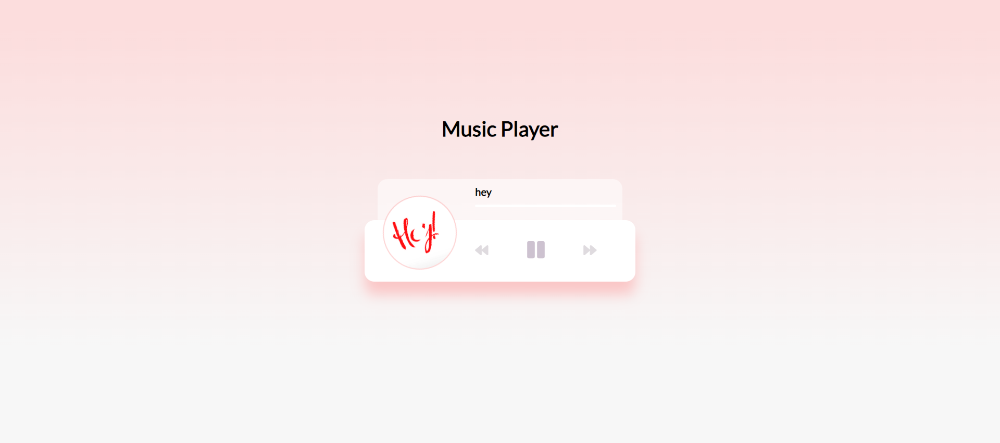
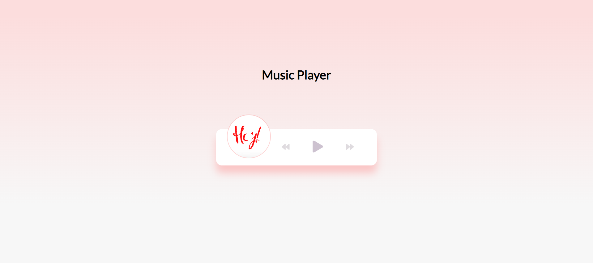

# **Music Player**

## **About**
Music player is a web application with play, pause, forward, and backward buttons for their corresponding operations. This application uses HTML, CSS, and Javascript.

## **GUI**
|Play UI|Pause UI|
|-------|--------|
|||